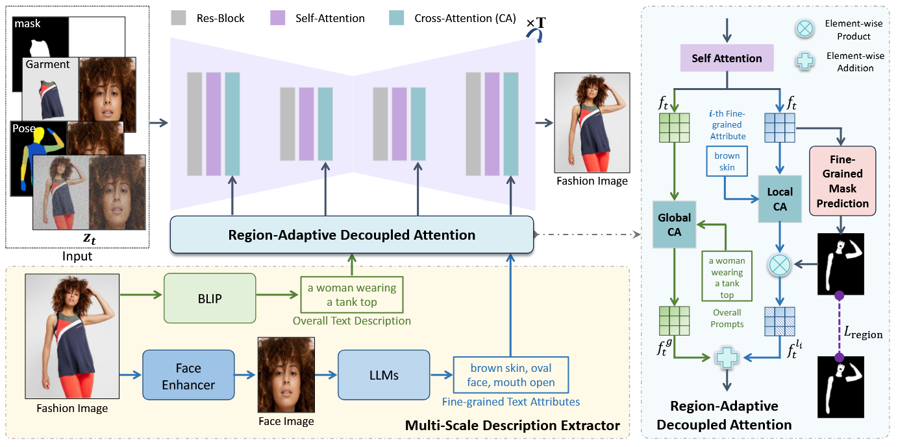

# FashionMAC: Deformation-Free Fashion Image Generation with Fine-Grained Model Appearance Customization

## 🏷️ Abstract

Garment-centric fashion image generation aims to synthesize realistic and controllable human models dressing a given garment, which has attracted growing interest due to its practical applications in e-commerce. The key challenges of the task lie in two aspects: (1) faithfully preserving the garment details, and (2) gaining fine-grained controllability over the model’s appearance. Existing methods typically require performing garment deformation in the generation process, which often leads to garment texture distortions. Also, they fail to control the fine-grained attributes of the generated models, due to the lack of specifically designed mechanisms. To address these issues, we propose FashionMAC, a novel diffusion-based deformation-free framework that achieves high-quality and  controllable fashion showcase image generation. The core idea of our framework is to eliminate the need for performing garment deformation and directly outpaint the garment segmented from a dressed person, which enables faithful preservation of the intricate garment details. Moreover, we propose a novel region-adaptive decoupled attention (RADA) mechanism along with a chained mask injection strategy to achieve fine-grained appearance controllability over the synthesized human models. Specifically, RADA adaptively predicts the generated regions for each fine-grained text attribute and enforces the text attribute to focus on the predicted regions by a chained mask injection strategy, significantly enhancing the visual fidelity and the controllability. Extensive experiments validate the superior performance of our framework compared to existing state-of-the-art methods.

## 🎉  Overview


> **Note on Implementation:** The quantitative metrics reported in our paper were obtained using the original LDM framework. This repository is implemented based on [Hugging Face Diffusers](https://github.com/huggingface/diffusers), which has led to further improvements in generation quality and metrics.

Below is the performance comparison of our released Diffusers-based implementation:

**1.With Facial Image Guidance**

| Inference Mode | FID ↓ | KID ↓ | CLIP-i ↑ | MP-LPIPS ↓ |
| :--- | :---: | :---: | :---: | :---: |
| **w/ Pose Predictor** | 9.87 | 0.0025 | 0.96 | 0.044 |
| **w/o Pose Predictor** | 11.32 | 0.0032 | 0.95 | 0.041 |

**2.With Text Image Guidance**

| Inference Mode | FID ↓ | KID ↓ | MP-LPIPS ↓ |
| :--- | :---: | :---: | :---: |
| **w/ Pose Predictor** | 9.14 | 0.0020 | 0.042 |
| **w/o Pose Predictor** | 11.31 | 0.0035 | 0.041 |

## 🔧 Requirements

To set up the environment, please use `conda` with the provided environment file:

```bash
conda env create -f environment.yml
conda activate FashionMAC
```

## 📥  Download Models

To run the inference, you need to download our pre-trained checkpoints and the base Stable Diffusion models.

**1. FashionMAC Checkpoints**
Download our trained models from the following link:
[FashionMAC Models](https://drive.google.com/file/d/1CAjJpNnykrSXsYoK-y7Zp63XmUpdJO_f/view?usp=drive_link)
**2. Base Models**
Please download the Stable Diffusion v1.4(or SD1.5) and VAE weights from Hugging Face and place them in the `ckpt/` directory:

- [Stable Diffusion v1.4](https://huggingface.co/CompVis/stable-diffusion-v1-4) or [stable-diffusion-v1-5](https://huggingface.co/stable-diffusion-v1-5/stable-diffusion-v1-5)
- [vae](https://huggingface.co/stabilityai/sd-vae-ft-ema)
  
**3. Directory Structure**

Ensure your `ckpt/` folder is organized as follows:
```bash
FashionMAC/
├── ckpt/
│   ├── FashionMAC_unet.pt                
│   ├── stable-diffusion-v1-4/            
│   │   ├── unet/
│   │   ├── text_encoder/
│   │   ├── tokenizer/
│   │   └── ...
│   ├── sd-vae-ft-ema/                    
│   │   ├── config.json
│   │   ├── diffusion_pytorch_model.bin
│   │   └── ...
│   └── pose_predictor/                   
│       ├── pose_predictor_unet.pt
│       ├── vqvae_config.yaml
│       └── vqvae_f8_step=58239.ckpt
├── assets/
│   └── ...
├── inference.py
└── ...
```
**Note**: If you store `stable-diffusion-v1-4` or `sd-vae-ft-ema` in a different path, please update the `--unet_pretrained_path` and `--vae_path` arguments in the scripts.

## 🚀 Inference
We provide two inference modes. 
**1.Inference**
If you already have a densepose image (e.g., `assets/input_images/densepose.jpg`), you can use this mode.
```bash
bash run_inference.sh
```

**2. Inference with Pose Predictor**
This mode automatically generates a densepose condition based on the input garment and then generates the final image.
```bash
bash run_inference_w_pose_predictor.sh
```

## 📊 Evaluation
To reproduce our quantitative results on the VITON-HD dataset, please download the pre-processed testing data provided below:
[Download Evaluation Data](https://drive.google.com/file/d/1a_zIUYIR9UJo4_xoJn9wJ-dT3EjXElU4/view?usp=drive_link)

```bash
### Dataset Structure
The downloaded evaluation dataset is organized as follows:

viton_test/
├── cloth/                  # Segmented garment images
├── cloth_mask/             # Binary masks for the Segmented garments
├── face/                   # Reference face images for identity guidance            # Text descriptions
├── global_prompts/         # Overall captions for the showcase images
└── local_prompts/          # Fine-grained attributes (e.g., skin, hair)
```

You can use these resources to evaluate the model's performance on the VITON-HD dataset.

## Citation
If you find this project useful for your research, please consider citing our paper:
```bash
@article{zhang2025fashionmac,
  title={FashionMAC: Deformation-Free Fashion Image Generation with Fine-Grained Model Appearance Customization},
  author={Zhang, Rong and Li, Jinxiao and Wang, Jingnan and Zuo, Zhiwen and Dong, Jianfeng and Li, Wei and Wang, Chi and Xu, Weiwei and Wang, Xun},
  journal={arXiv preprint arXiv:2511.14031},
  year={2025}
}
```